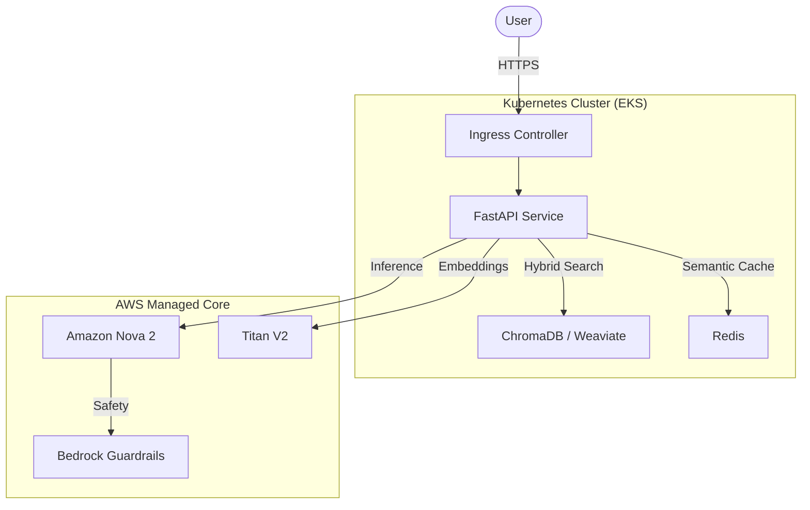

# LLMOps RAG Pipeline

**Production-Grade AI Orchestration: AWS, Kubernetes, and Enterprise MLOps**

This project demonstrates a rigorous, first-principles approach to building, deploying, and operating an LLM-powered RAG system. It prioritizes **architectural control**, **cost governance**, and **operational excellence** over simple prototyping.

---

## 🏗️ High-Level Architecture

We employ a **Hybrid Architecture** that balances self-managed Kubernetes components with high-performance AWS managed services.



---

## 🎯 The "Big 3" Value Pillars

### 1. Hybrid Implementation Strategy
Combines the learning depth of **custom orchestration** with the scale of **enterprise cloud**.
- **Build**: Custom LangChain pipeline & K8s orchestration.
- **Use**: Amazon Nova 2 (LLM), Titan V2 (Embeddings), and Bedrock Guardrails.

### 2. Aggressive Cost Governance
A system designed to be sustainable.
- **Pause/Resume**: Full infrastructure teardown via Terraform (~90% savings).
- **Semantic Caching**: Reducing LLM calls by ~70% via Redis.
- **Intelligent Routing**: Dynamic model selection (Lite vs. Pro) based on query complexity.

### 3. Enterprise MLOps & LLMOps
Moving beyond "it works" to "it scales."
- **Dual-Path Ingestion**: Automated GitHub Actions data-sync vs. Real-time User Upload.
- **Quality Gates**: Automated evaluation pipelines blocking regression in CI/CD.
- **Drift Detection**: Proactive monitoring of query distribution and document relevance.

---

## 🗺️ Documentation Navigation Map

Stop here for the high-level view. Dive deeper for the engineering specifics.

| Document | Architectural Purpose |
| :--- | :--- |
| **[Architectural Strategy](project-docs/decisions_summary.md)** | **The "Why"**: Hybrid "Build vs. Use" rationale & cost matrices. |
| **[Environment Strategy](project-docs/environment_strategy.md)** | **The "Where"**: Namespace isolation & resource planning. |
| **[Implementation Methodology](project-docs/implementation_methodology.md)** | **The "How"**: The "Verify First" (Console → Terraform) pattern. |
| **[MLOps Blueprint](project-docs/mlops_folder_explained.md)** | **The Lifecycle**: Continuous engineering & operational outcomes. |
| **[Branching & Workflow](project-docs/branching_strategy.md)** | **The Process**: PR-based GitHub Flow & deployment lifecycle. |

---

## 🛠️ Technology Stack & Rationale

| Component | Choice | Architectural Reasoning |
| :--- | :--- | :--- |
| **Compute** | **Amazon EKS** | Industry-standard orchestration with full pause/resume control. |
| **IaC** | **Terraform** | Cloud-agnostic state management and reproducibility. |
| **LLM** | **Amazon Nova 2** | Latest 2026 model family; faster/cheaper than GPT-4. |
| **Embeddings** | **Titan V2** | Normalized vectors optimized for hybrid search. |
| **Vector DB** | **ChromaDB / Weaviate** | Self-managed on K8s for maximum indexing control. |
| **Safety** | **Bedrock Guardrails** | Enterprise-grade PII masking and topic boundaries. |

---

## 📂 Project Structure Overview

```bash
llmops-rag-pipeline/
├── api/                 # FastAPI backend with RAG orchestration
├── terraform/           # Complete AWS Infrastructure-as-Code
├── kubernetes/          # K8s manifests & Kustomize overlays
├── mlops/               # Operational tools (Monitoring, Eval, Drift)
├── .github/workflows/   # CI/CD & Data-Sync pipelines
└── project-docs/        # Strategic & Architectural documentation
```

---

## 📊 Measurable Engineering Outcomes

- **65% Monthly Cost Reduction**: achieved through comprehensive governance strategies.
- **Zero-Regression Deployments**: enforced by automated quality gates.
- **100% Infrastructure Reproducibility**: via Terraform and GitOps practices.

---

## 📝 License
MIT License - see [LICENSE](./LICENSE) file for details.

*Active Project: Designed to demonstrate production-grade LLMOps mastery.*
