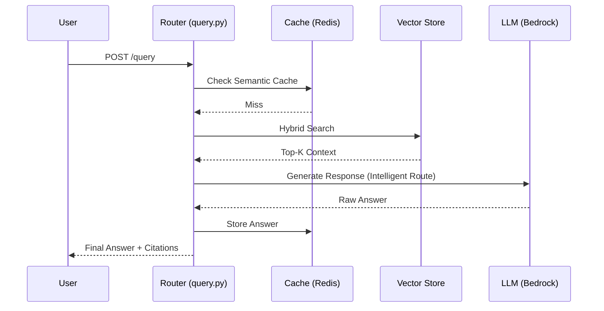

# API Folder Structure & Architectural Roles

The `api/` folder contains the FastAPI application that serves as the backend for the RAG system. It is designed for **portability, cost-efficiency, and modularity.**

---

## 🗺️ High-Level Quick Reference

| Folder/File | Primary Responsibility | Architectural Logic |
| :--- | :--- | :--- |
| **`main.py`** | Application Entry | Global config, Middleware, Route registration. |
| **`routers/`** | API Endpoints | HTTP layer. Handles requests/responses. |
| **`services/`** | Business Logic | The "Workhorses". Bedrock, Vector DB, Caching logic. |
| **`models/`** | Data Validation | Pydantic schemas for strict payload typing. |
| **`utils/`** | Helpers | Agnostic logic like PDF parsing and chunking. |
| **`Dockerfile`** | Self-Contained Build | Follows the Microservices pattern. |

---

## 📂 Folder Structure

```
api/
├── main.py                      # FastAPI application entry point
├── config.py                    # Configuration management
├── Dockerfile                   # Container definition
├── requirements.txt             # Python dependencies
│
├── routers/                     # API route handlers
│   ├── documents.py             # Document upload/delete
│   ├── query.py                 # Q&A endpoints
│   └── health.py                # Health checks
│
├── services/                    # Business logic
│   ├── embedding_service.py     # Titan Embeddings V2
│   ├── llm_service.py           # Amazon Nova 2
│   ├── vector_store_service.py  # ChromaDB/Weaviate
│   ├── cache_service.py         # Redis semantic caching
│   └── guardrails_service.py    # Bedrock Guardrails
│
├── models/                      # Pydantic schemas
│   └── schemas.py
│
└── utils/                       # Helper functions
    ├── chunking.py              # Document chunking
    └── hybrid_search.py         # Vector + keyword search
```

---

## 🛣️ API Routers (The Interface)

These files define the public endpoints of your system.

### `health.py` - Monitoring & Probes
**Primary Role:** System status & K8s Health.

<details>
<summary>▶️ <b>Technical Details (Click to expand)</b></summary>

- **GET /health**: Basic uptime check.
- **GET /health/ready**: Readiness probe for K8s (checks DB/Redis connectivity).
- **GET /health/live**: Liveness probe for K8s (process check).
</details>

### `documents.py` - Ingestion Path
**Primary Role:** Handling the "Knowledge" intake.

<details>
<summary>▶️ <b>Technical Details (Click to expand)</b></summary>

- **POST /documents/upload**: Orchestrates Parsing → S3 Upload → Embedding → Vector DB.
- **DELETE /documents/{id}**: Cleanup of vectors and files.
</details>

### `query.py` - Retrieval & Generation
**Primary Role:** The core RAG "Ask" loop.

<details>
<summary>▶️ <b>Technical Details (Click to expand)</b></summary>

- **POST /query**: Orchestrates Cache lookup → Retrieval → LLM Generation → Guardrails.
- **POST /query/batch**: Bulk evaluation support.
</details>

---

## 🧠 Services (The Engine)

These files contain the implementation of your LLMOps and MLOps strategies.

### `llm_service.py` - Intelligent Routing
**Strategy:** Cost Optimization.

<details>
<summary>▶️ <b>Technical Details (Click to expand)</b></summary>

- `select_model()`: Routes simple queries to Lite and complex to Pro.
- `apply_domain_prompt()`: Context-aware prompt injection.
- **Cost Tracking:** Logs tokens per request.
</details>

### `embedding_service.py` - Vector Store
**Strategy:** MLOps Feature Versioning.

<details>
<summary>▶️ <b>Technical Details (Click to expand)</b></summary>

- `generate_embedding()`: 1024-dimension normalized vectors.
- `calculate_similarity()`: Logic for semantic cache hits.
</details>

### `cache_service.py` - Semantic Caching
**Strategy:** Speed & 70% Cost Reduction.

<details>
<summary>▶️ <b>Technical Details (Click to expand)</b></summary>

- `get_cached_response()`: Checks similarity > 0.95.
- `cache_response()`: Stores answer + embedding hash.
</details>

### `vector_store_service.py` - Storage
**Strategy:** Persistence & Search.

<details>
<summary>▶️ <b>Technical Details (Click to expand)</b></summary>

- `hybrid_search()`: Combines Vector and Keyword matching.
- Metadata Filtering: Ensures data isolation.
</details>

### `guardrails_service.py` - Safety
**Strategy:** Enterprise Compliance.

<details>
<summary>▶️ <b>Technical Details (Click to expand)</b></summary>

- `apply_guardrails()`: PII masking and Content Filtering.
- `validate_query/response()`: Pre/Post-generation checks.
</details>

---

## 🔄 The Request Flow (At a Glance)

Knowing how these files collaborate is key to troubleshooting:



---

## 🛠️ Containers & Config

<details>
<summary>▶️ <b>Dockerfile - Portability Rationale (Click to expand)</b></summary>

- **Build context:** Optimized via `.dockerignore` for speed.
- **Portability:** Built from the root but defined inside `api/` to follow microservices patterns.
- **Usage:** `docker build -t llmops-api -f api/Dockerfile .`
</details>

<details>
<summary>▶️ <b>config.py - Centralized State (Click to expand)</b></summary>

- Manages all environment variables (AWS Regions, Bucket Names, Model IDs).
- Uses Pydantic for strict validation so the app won't start with missing keys.
</details>

---

## 🎯 Summary for Future Readers
When you come back to this after weeks:
1.  **Change an Endpoint?** Look in `routers/`.
2.  **Optimize AI behavior?** Look in `services/`.
3.  **App failing on start?** Check `config.py`.
4.  **Container build slow?** Check `.dockerignore`.
