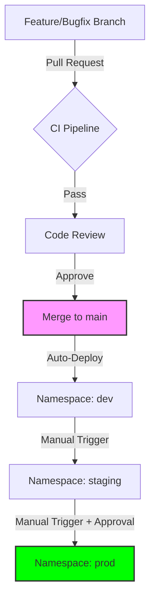

# Branching and Workflow Strategy

This project uses **GitHub Flow** - a streamlined, PR-based branching strategy emphasized for continuous integration and deployment (CI/CD).

---

## 🗺️ Deployment Lifecycle (At a Glance)



---

## 🌲 Branching Model

| Branch Type | Name Pattern | Purpose |
| :--- | :--- | :--- |
| **Production** | `main` | Production-ready, always deployable. |
| **Features** | `feature/*` | New functional changes. |
| **Bugs** | `bugfix/*` | Non-critical repairs. |
| **Critical** | `hotfix/*` | Immediate production patches. |
| **Data** | `data/*` | Document ingestion (**Data-as-Code**). |

---

## 🌐 Environment & Namespace Mapping

| Environment | Git Trigger | K8s Namespace | AWS Resource Tags |
| :--- | :--- | :--- | :--- |
| **Development** | Merge to `main` | `dev` | `Env: dev` |
| **Staging** | Manual Dispatch | `staging` | `Env: staging` |
| **Production** | Manual + Approval | `prod` | `Env: prod` |

---

## 📝 Pull Request Standards

To ensure production-grade quality, every PR should use a standard template.

> [!TIP]
> **Recommended Template Location:** `.github/pull_request_template.md`

### **PR Checklist:**
- [ ] **What:** Brief description of changes.
- [ ] **Why:** The problem being solved or feature added.
- [ ] **How:** High-level implementation details.
- [ ] **Verification:** Screenshots, logs, or command output showing it works.

---

## 📑 Workflow Walkthroughs

<details>
<summary>▶️ <b>Scenario 1: Adding a New Feature (Code)</b></summary>

1. **Local Setup:**
   ```bash
   git checkout -b feature/intelligent-routing
   ```
2. **Develop & Commit:** Use descriptive messages.
3. **Push & PR:** Create PR to `main`.
4. **CI/CD:** Wait for green checks, get approval, and merge.
</details>

<details>
<summary>▶️ <b>Scenario 2: Data-as-Code (Document Upload)</b></summary>

Documents are treated like code. Adding a PDF requires a PR.
1. **Branch:** `git checkout -b data/q1-reports`
2. **Add:** Place documents in `data/documents/`.
3. **Sync:** Merge to `main` triggers the `data-sync.yml` workflow, which handles S3 upload and Embedding generation.
</details>

<details>
<summary>▶️ <b>Scenario 3: Emergency Hotfix</b></summary>

1. **Branch:** `git checkout -b hotfix/revert-bad-cache`
2. **Deploy:** Merge to `main`, then manually promote through environments at high speed.
</details>

---

## ⚙️ Workflow Triggers (GitHub Actions)

| Workflow | Trigger | Action |
| :--- | :--- | :--- |
| `ci.yml` | `pull_request` to `main` | Lint, Test, Scan, Build. |
| `cd-dev.yml` | `push` to `main` | Deploy to `dev` namespace. |
| `data-sync.yml` | `push` to `data/` path | S3 Upload + Embedding. |
| `infra.yml` | `push` to `terraform/` | Terraform Plan/Apply. |

---

## 🎯 Best Practices
1. **Short-Lived Branches:** Merge within 2-3 days to avoid "Merge Hell".
2. **Descriptive Names:** `feature/add-redis` > `fix-1`.
3. **Test Locally First:** Never let CI be the first time your code runs.
4. **Delete Merged Branches:** Keep the remote repository clean.
