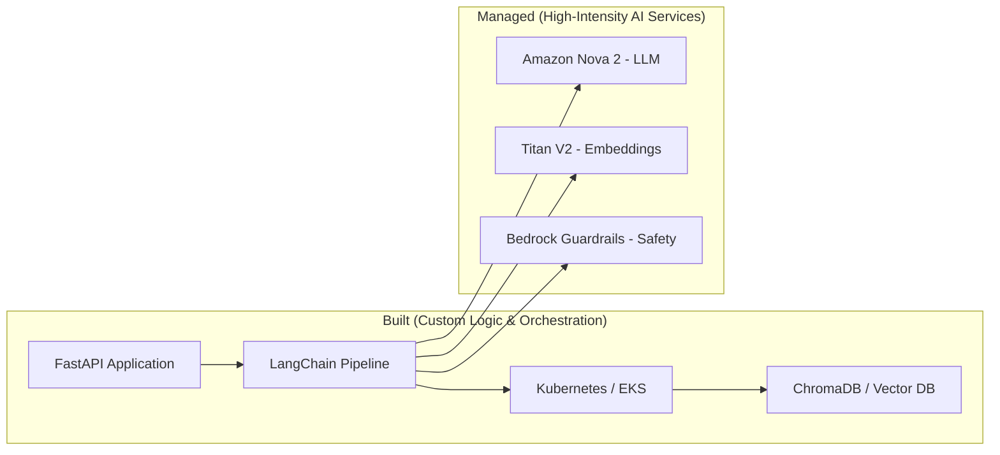

# Architectural Strategy & Decision Summary

This document provides a comprehensive overview of the core architectural logic, strategic decisions, and cost governance underpinning the LLM-powered RAG pipeline.

---

## 🏗️ Hybrid Architecture: "Build vs. Use"

We balance deep technical mastery (custom orchestration) with enterprise-grade scaling (managed services).

### **1. Major Decision: The Hybrid Approach**
**Decision**: Combine self-managed Kubernetes components with cutting-edge AWS managed services.
- **Architectural Depth**: Deep-dive into core RAG internals and Kubernetes orchestration.
- **Enterprise Scale**: Leveraging the latest 2026 AWS tech (Nova 2, Titan V2, Guardrails).
- **Cost Optimization**: Utilizing a "Pause/Resume" architecture to minimize cloud overhead.

---

## 🛠️ Technology Stack Finalization

### **Core Engineering (First-Principles Implementation)**
- ✅ **Vector Database**: ChromaDB/Weaviate on Kubernetes (Full control over indexing/retrieval).
- ✅ **RAG Pipeline**: Custom LangChain orchestration (Internal optimization mastery).
- ✅ **Infrastructure**: Terraform + EKS (Cloud-agnostic automation skills).
- ✅ **Monitoring**: Helm (kube-prometheus-stack) on K8s (Standardized Enterprise Observability).

### **AWS Managed (Enterprise Features)**
- ✅ **LLM**: Amazon Nova 2 (Replaces Claude 3/GPT-4; faster, AWS-native).
- ✅ **Embeddings**: Titan Embeddings V2 (Normalized vectors optimized for hybrid search).
- ✅ **Security**: Bedrock Guardrails (Enterprise-grade PII masking and safety controls).

---

## 🔄 Architectural Evolution: Baseline vs. Optimized

| Aspect | Baseline Proposal | Optimized Implementation | Impact |
| :--- | :--- | :--- | :--- |
| **LLM** | Claude 3 / GPT-4 | **Amazon Nova 2** | Latest 2026 Tech + Lower Cost |
| **Embeddings** | Sentence Transformers | **Titan Embeddings V2** | Normalized Vectors + AWS Native |
| **Security** | Basic IAM | **Bedrock Guardrails** | Enterprise PII Masking & Safety |
| **Search** | Vector Similarity | **Hybrid (Vector + BM25)** | Higher Accuracy for Technical Data |
| **Ingestion** | Web UI only | **Dual-Path (UI + CI/CD)** | Developer & User Flexibility |
| **Architectural Depth** | Balanced | **First-Principles Mastery** | Demonstrates proficiency in both AI & Infrastructure |

---

## 💰 Cost Governance & Optimization

### **Executive Optimization Matrix**

| Strategy | Tactical Implementation | Estimated Impact |
| :--- | :--- | :--- |
| **Lifecycle Mgmt** | S3 Transition (Standard-IA → Glacier) | 40% Storage Saving |
| **Semantic Cache** | Similarity lookup in Redis (Similarity > 0.95) | 70% Token Reduction |
| **Intelligent Route** | Query complexity analysis (Lite vs. Pro) | 60% Cost Reduction |
| **Pause/Resume** | Infrastructure teardown via Terraform destroy | 90% Idle Cost Avoidance |

### **Projected Phased Budget**
| Phase | Focus | Estimated Cost |
| :--- | :--- | :--- |
| **Phases 1-4** | Local Development & Cloud Prototyping | ~$60-120 |
| **Phases 5-6** | Optimization & Local K8s | ~$40-70 |
| **Phases 7-8** | EKS Deployment & Scaling | ~$100-120 |
| **Ongoing** | Maintenance (S3 + ECR only) | ~$2-5 / month |

---

## 📑 Strategic Key Differentiators

This project demonstrates proficiency across the modern AI and DevOps landscape:

1. ✅ **Advanced Retrieval**: Implementing Hybrid search (Vector + Keyword) for production accuracy.
2. ✅ **DevOps Excellence**: Dual-path ingestion (Web UI + GitHub Actions automated sync).
3. ✅ **MLOps Mastery**: Semantic caching, intelligent routing, and Bedrock security integration.
4. ✅ **Cost Awareness**: Built-in "Pause/Resume" flows for early-stage prototype funding.

---

▶️ <b>Documentation & Change Governance (Click to expand)</b>

### **Inventory of Updates**
- **README.md**: Standardized tech-stack rationale and architectural decision records (ADRs).
- **project_proposal.md**: Updated to include Nova 2 models and dual-path document ingestion.
- **task.md**: Synchronized phase-by-phase implementation checklist.

▶️ <b>Architectural Response Logic (Click to expand)</b>

- **Why self-managed vector DB?** Maximum architectural depth and operational control over indexing costs.
- **Why not Bedrock Knowledge Bases?** To prioritize a first-principles understanding of the RAG pipeline mechanics.
- **Why automated data-sync?** To demonstrate MLOps maturity by treating "Data-as-Code" via CI/CD.

---

## 🛡️ Architectural & Strategic Impact

By prioritizing **Pragmatic Engineering** and **Cost Governance**, this project achieves:

- **Technical Breadth**: Full-stack expertise across AI, Infrastructure, and Backend logic.
- **Production Readiness**: Security-first design using enterprise guardrails and IAM least-privilege.
- **Business Logic**: Clear ROI through measurable cost-avoidance strategies.
- **Scalability**: A modular architecture ready for production-scale traffic.

**Status**: Verified & Ready for Phased Implementation.
