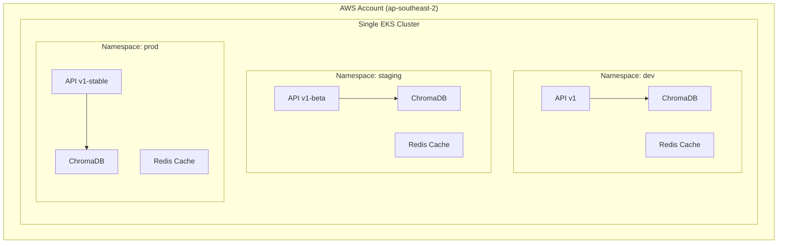

# Environment Strategy: Single Cluster, Multiple Namespaces

This project uses a **Single EKS Cluster + Kubernetes Namespaces** to balance production-grade isolation with a strictly optimized cost profile.

---

## 🗺️ Shared Architecture (Phases 7-8)

By sharing the Control Plane, we achieve environment isolation without the overhead of multiple expensive EKS clusters.



---

## 📊 Cost-Isolation Matrix

The rationale behind our choosing "Single Cluster with Namespaces" for this portfolio project.

| Option | Cost (2 wks) | Isolation | Complexity | Decision |
| :--- | :--- | :--- | :--- | :--- |
| **Namespaces** | **~$100** | Logical (K8s) | Moderate | ✅ **Selected** |
| **Separate Clusters** | ~$350 | Physical (AWS) | High | ❌ Too Expensive |
| **Single Namespace** | ~$100 | None | Low | ❌ Unprofessional |

---

## 🛠️ Implementation Hierarchy

Detailed configurations for both Infrastructure-as-Code and Kubernetes orchestration.

<details>
<summary>▶️ <b>Terraform Environment Modules (Click to expand)</b></summary>

```
terraform/
├── modules/              # Reusable Blueprints (eks, vpc, s3, iam)
└── environments/
    ├── dev/              # ACTIVE: Defines the shared cluster
    │   ├── main.tf
    │   └── terraform.tfvars
    ├── staging/          # Portfolio Only: Overrides for staging logic
    └── prod/             # Portfolio Only: Overrides for production logic
```
</details>

<details>
<summary>▶️ <b>Kubernetes Kustomize Overlays (Click to expand)</b></summary>

```
kubernetes/
├── base/                 # Standard Deployments/Services
└── overlays/             # Environment-specific overrides
    ├── dev/              # Resource limits: 256Mi, 1 Replica
    ├── staging/          # Resource limits: 512Mi, 2 Replicas
    └── prod/             # Resource limits: 1Gi, 3 Replicas
```
</details>

---

## 💡 Architectural Rationale & Design Principles

> [!IMPORTANT]
> **Key Architectural Advantages:** Our chosen strategy prioritizes **Pragmatic Engineering** and cost-efficiency without compromising production-grade standards:
> - **Cost-Efficiency:** Reduces cloud overhead by ~70% through shared control planes while maintaining environment parity.
> - **Platform Mastery:** Demonstrates advanced Kubernetes orchestration using Namespace isolation, Resource Quotas, and Kustomize overlays.
> - **Scalability Path:** The modular Terraform design allows for "Lazy Scaling"—facilitating a seamless transition to separate clusters if future load or compliance requirements dictate.

---

## 📉 Configuration Differences

| Feature | `dev` | `staging` | `prod` |
| :--- | :--- | :--- | :--- |
| **Log Level** | DEBUG | INFO | WARN |
| **Auto-scaling** | Disabled | 2-3 Replicas | 3-5 Replicas |
| **Persistence** | Instant | 15 min Sync | Real-time |

---

## 🎯 Summary
- **Strategy:** Logical isolation via K8s Namespaces.
- **Goal:** Production-grade simulation on a startup budget.
- **Value:** Shows you can make architecturally sound, cost-conscious infrastructure decisions.
