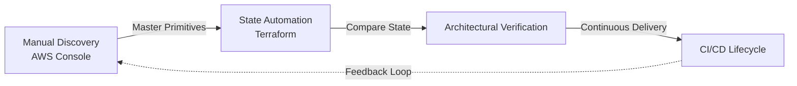

# Implementation Methodology: Technical Mastery & State Automation

This project follows a **Hybrid Implementation Approach** designed to ensure deep architectural domain knowledge alongside production-grade Infrastructure-as-Code (IaC) automation.

---

## 🔄 Engineering Pattern: The "Verify First" Loop

For every major component, we follow a rigorous three-step validation cycle to ensure the underlying AWS primitives are mastered before they are automated.



---

## 📊 Operational Proficiency Matrix

By following this "Console → Terraform" pattern, we achieve a higher standard of engineering discipline.

| Capability | Tactical Outcome | Strategic Value |
| :--- | :--- | :--- |
| **System Visibility** | Confident AWS Navigation | Immediate Root Cause Analysis |
| **State Mastery** | Full Console/TF Mapping | Deep Troubleshooting Skills |
| **Infrastructure-as-Code** | Reproducible Blueprints | Scalable Multi-Env Delivery |
| **Operational Readiness** | Manual & Auto Proficiency | Resilient System Management |

---

## 🛠️ Procedural Deep-Dive: S3 Architecture

<details>
<summary>▶️ <b>Case Study: Incremental S3 Deployment (Click to expand)</b></summary>

### **Step 1: Manual Discovery (Discovery Phase)**
1. **Initialize**: Create `llmops-rag-documents-dev` in the AWS Console.
2. **Parameters**: Define SSE-S3 encryption, transition to Standard-IA (30 days), and enable versioning.
3. **Logic**: Understand exactly *how* AWS handles object metadata and bucket policies before coding.

### **Step 2: Terraform State Automation (Implementation Phase)**
```hcl
# terraform/modules/s3/main.tf
resource "aws_s3_bucket" "documents" {
  bucket = "llmops-rag-documents-dev"
  
  tags = {
    Project     = "LLMOps"
    Environment = "dev"
  }
}

resource "aws_s3_bucket_versioning" "documents" {
  bucket = aws_s3_bucket.documents.id
  versioning_configuration { status = "Enabled" }
}

resource "aws_s3_bucket_server_side_encryption_configuration" "documents" {
  bucket = aws_s3_bucket.documents.id
  rule {
    apply_server_side_encryption_by_default { sse_algorithm = "AES256" }
  }
}
```

### **Step 3: State Verification (Audit Phase)**
1. **Audit**: Match the Terraform-created resource against the manual baseline.
2. **Cleanup**: Decommission manual prototypes and import TF-managed state into the primary project pipeline.
</details>

---

## 🏗️ Architectural Scenario Walkthrough

### **Core Scenario: Infrastructure Failure & Recovery**

> [!IMPORTANT]
> **Engineering Response:** "In a production incident where Terraform fails due to drift, I leverage my **Operational Proficiency** to manually audit the state in the AWS Console. I can map CLI errors directly to UI configurations, identify the mismatch, and use `terraform import` or state correction to restore the automated lifecycle."

---

## 💡 Technical Domain Expertise

| Focus Area | Core Competencies | Architectural Scope |
| :--- | :--- | :--- |
| **Cloud Primitives** | S3, IAM, VPC | Foundation Networking & Security |
| **Compute & K8s** | EKS, EC2, IRSA | Orchestration & Resource Optimization |
| **Observability** | CloudWatch, Metrics | Governance & Incident Response |
| **Governance** | Cost Explorer, Tags | Resource Allocation & ROI Tracking |

---

## 🛡️ Professional Proficiency Outcomes

By prioritizing **Technical Depth over Speed**, this methodology produces:
1. **Full-Stack Competency**: Expertise in both Higher-Level (TF) and Lower-Level (AWS) primitives.
2. **Resilient Debugging**: Rapid issue identification via visual and code-based state analysis.
3. **Architecture Ownership**: A methodology where every line of code is backed by a first-principles understanding.

**Status**: Verified & Adopted for all Project Phases.
