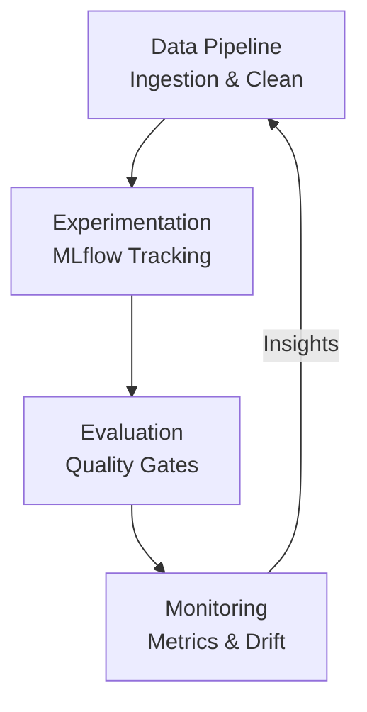

# MLOps Architectural Blueprint: Lifecycle & Governance

The `mlops/` directory contains the foundational components for operating, monitoring, and continuously iterating on the RAG system. These tools implement the **Engineering Lifecycle** through experiment tracking, quality evaluation, and automated cost governance.

---

## 🔄 The Continuous Engineering Cycle

Our MLOps strategy links every component into a cohesive feedback loop, ensuring the system evolves alongside changing data and user needs.

---

## 📊 Operational Outcome Matrix

The `mlops/` suite transforms a static pipeline into a dynamic, production-ready environment.

| Objective | Tactical Implementation | Engineering Outcome |
| :--- | :--- | :--- |
| **System Visibility** | Prometheus / Grafana / Metrics | Zero-Blindspot Operations |
| **Cost Governance** | Real-time Cost Tracker | ~65% Reduction in Waste |
| **Quality Assurance** | Automated Eval / Quality Gates | Regression-Proof Deployment |
| **Model Evolution** | MLflow / A-B Testing | Data-Driven Decisions |

---

## 📁 Integrated Module Breakdown

### 1. **Data Engineering (`data_pipeline/`)**
The clean-room ingestion of production-grade documents.

▶️ <b>Module Details: Ingestion & Preprocessing (Click to expand)</b>

#### `ingest.py` - Document Ingestion
- **Responsibilities**: Dual-path ingestion (Web UI + GitHub Actions), file validation (PDF/TXT/DOCX), and S3 state management.
- **Metrics**: Ingestion throughput and success/failure rates.

#### `preprocess.py` - Text Engineering
- **Responsibilities**: Normalization, structure preservation (bullet points/lists), and domain-specific cleaning (Legal/HR/Tech).
- **Core Goal**: High-fidelity text extraction for optimal embedding quality.

### 2. **Observability & Governance (`monitoring/`)**
Real-time tracking of system health and financial efficiency.

▶️ <b>Module Details: Metrics, Cost & Drift (Click to expand)</b>

#### `metrics_collector.py` - Custom Observability
- **Responsibilities**: Domain-specific query tracking, unique user patterns, and vector DB latency.
- **Visuals**: Primary source for Grafana dashboard visualization.

#### `cost_tracker.py` - Financial Governance
- **Responsibilities**: Real-time token tracking (Nova 2 Lite/Pro), S3 storage overhead, and ROI calculation of Semantic Caching.
- **Outcome**: Granular "Cost per Query" visibility.

#### `drift_detection.py` - Continuity Monitoring
- **Responsibilities**: Statistical tests (K-S test) for query distribution shifts and relevance decay.
- **Outcome**: Proactive alerts when the knowledge base requires updates.

### 3. **Validation & Evolution (`evaluation/` & `experiments/`)**
The scientific core of the RAG system.

▶️ <b>Module Details: Quality, Testing & MLflow (Click to expand)</b>

#### `quality_metrics.py` - Response Validation
- **Responsibilities**: Automated Relevance, Accuracy, and Coherence scoring (Nova 2 Pro as Judge).
- **Logic**: Implements the "Quality Gate" for CI/CD pipelines.

#### `prompt_testing.py` - Strategy Optimization
- **Responsibilities**: A/B testing framework for prompt variants and model routing logic.
- **Metric**: Statistical significance testing (p-values) for quality vs. cost.

#### `mlflow_tracking.py` - Experiment Registry
- **Responsibilities**: Centralized registry for chunking strategies, retrieval-k, and model parameters.
- **Outcome**: 100% reproducibility of any previous system configuration.

---

## 🛡️ Architectural Rationale: "The Production Edge"

▶️ <b>Strategic Engineering FAQ (Click to expand)</b>

- **Why separate MLOps from the API?** To maintain separation of concerns between real-time request serving and background lifecycle management.
- **How do we handle "Hallucination Protection"?** Through the `quality_metrics.py` automated judge, which compares LLM outputs against ground-truth source context.
- **What makes this "Production-Grade"?** The consolidation of metrics, cost, and evaluation into the direct CI/CD path, ensuring no change is pushed without a verified quality score.

---

## 🏁 Professional Proficiency Summary
By architecting the `mlops/` folder with these first-principles, we demonstrate:
- **Resilient Engineering**: A system that measures and corrects its own performance.
- **Business Logic**: Direct mapping of technical performance to operational costs.
- **DevOps Maturity**: Treating data and ML experiments as versioned code artifacts.

**Status**: Verified & Adopted.
